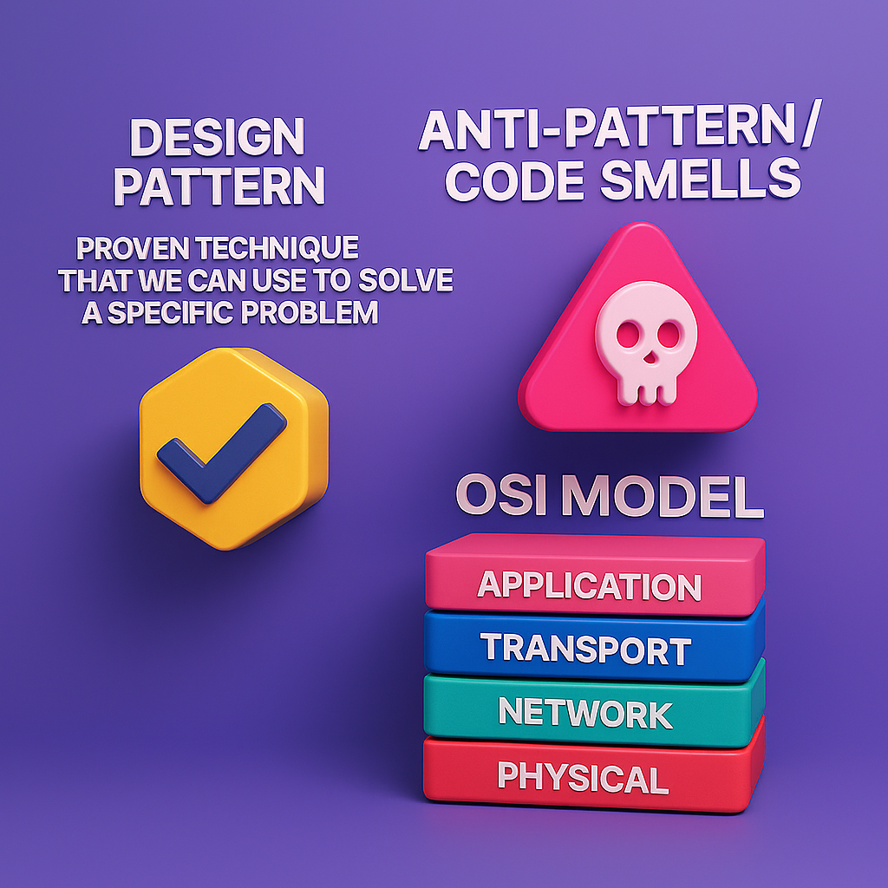

[Back to Home](README.md)

## Chapter 1

## Introduction

**Design pattern** is a _proven technique that we can use to solve a specific problem_

**Anti-Pattern / Code smells**: 
- Code smells are indications that a part of the codebase may not be following the  best practices or may be violating the SOLID principles.
- Code smells are not bugs, they are just indicators that the code may not be following the best practices.
- The main problem in Anti Patterns coding is that the code will be hard to maintain

**Understanding the web** (Request/Response):
  1. The communication starts
  2. The client sends a request to the server
  3. The server receives the request 
  4. The server processes the request (execute/code logic)
  5. The server sends a response back to the client
  6. The client receives the response and the cycle ended

**OSI Model**: The OSI model is a conceptual model that characterizes and standardizes the communication functions of a telecommunication system into seven abstraction layers.