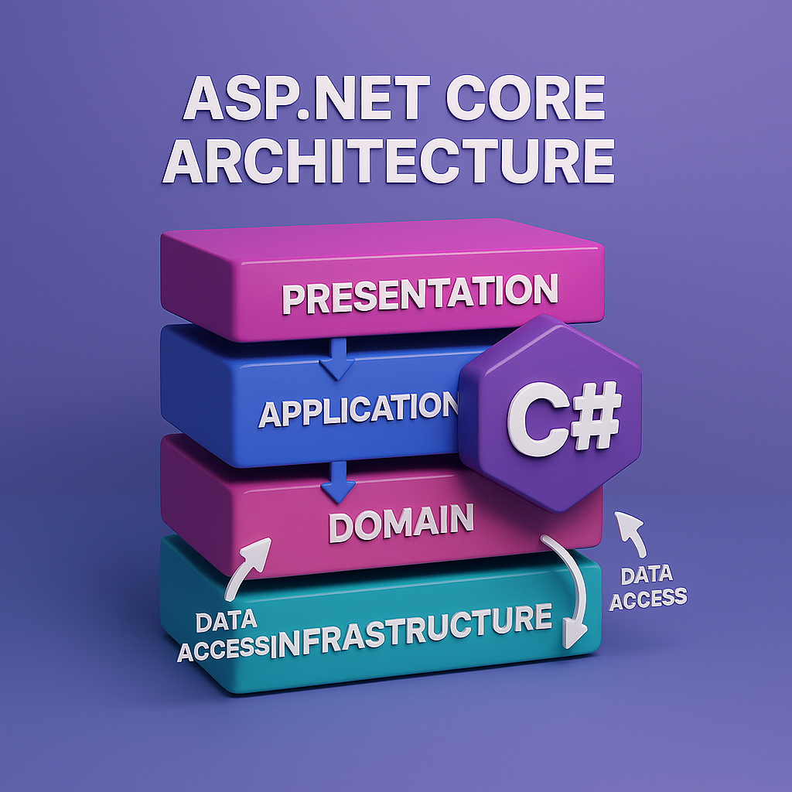
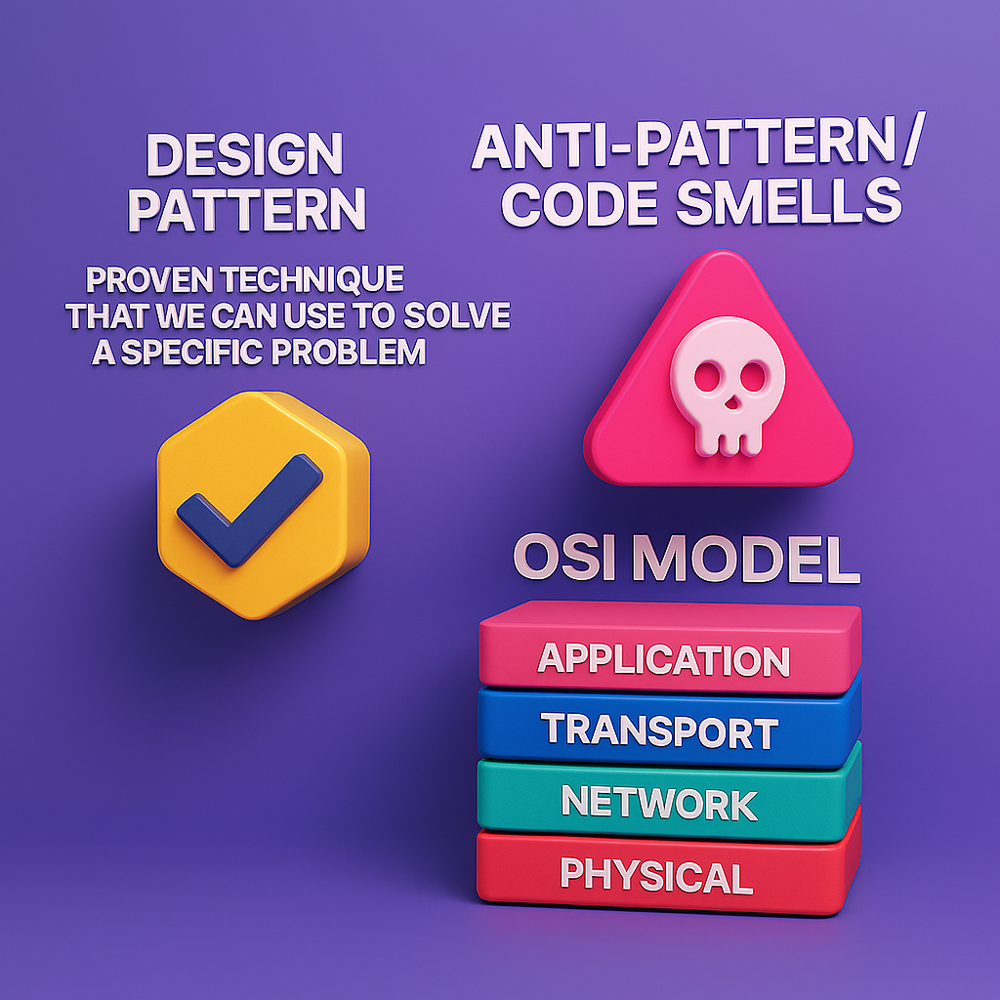

# Architecting Asp.Net Core Applications Third Edition Book Digest

## Section 1: Principles and Methodologies

### Chapter 1

**Introduction**


**Design pattern** is a _proven technique that we can use to solve a specific problem_

**Anti-Pattern / Code smells**: 
- Code smells are indications that a part of the codebase may not be following the  best practices or may be violating the SOLID principles.
- Code smells are not bugs, they are just indicators that the code may not be following the best practices.

**Understanding the web** (Request/Response):
  1. The communication starts
  2. The client sends a request to the server
  3. The server receives the request 
  4. The server processes the request (execute/code logic)
  5. The server sends a response back to the client
  6. The client receives the response and processes it
**OSI Model**: The OSI model is a conceptual model that characterizes and standardizes the communication functions of a telecommunication system into seven abstraction layers.


### Chapter 2 *Automated Testing*
**Types**
- Unit Tests (as needed)
- Integrated Tests (most)
- E2E Tests (few)

**Testing Techniques**
- White-Box
- Black-Box
- Gray-Box

**Testing Frameworks**
- xUnit
- NUnit
---    
### Chapter 3
**Architectural Principles**
1. DRY
    This principle advocate the SoC (Seperation Of Concern) princile
2. KISS
    This principle emphasizes the idea that systems work best when they are kept simple 
3. YAGNI
    Don't add functionality untill you need it    
4. SOLID
.***SRP*** Single Resposibility Principle
.***OCP*** Open/Closed Principle
.***LSP*** Liskov Substitution Principle
.***ISP*** Interface Segregation Principle
.***DIP*** Dependency Inversion Principle

---

### Chapter 4 *Rest APIs*
1. Is internet-based web service use HTTP as a transport protocol
2. Methods/Verbs : GET,POST,PUT,DELETE,PATCH
3. HTTP Status Codes: 20X OK, 30X Redirection, 40X Client Side Errors, 50X Server Side Errors
4. HTTP Headers: Location , Allow , ETag , Authorization , Retry-After , Cache-Control
5. API Versioning
6. DTO: Data Transfer Object, Is a layer between "Domain" and "Presentation"
7. __API Contract__ Between the API and Consumers, Endpoint has signature with 4 segmants, Example

| Contract Segmant | Value |
| ---------------- | ----- |
| Http Method      | Post  |
| Uri              |  /    |
| Input            | Dto as Json  |
| Output           | Dto as Json  |


## Section 2: Designing with ASP.NET Core
### Chapter 5 *Minimal APIs*
* Top Level Statements: Now in Entry point(program.cs) we can stop using namespaces
* Minimal Hosting: Combine two files (startup & program) into single file "program.cs" this laverage to minimize the biolerplate code necessary to bootstrap the application
```C#
WebApplicationBuilder builder = WebApplication.Create(args);
webApplication app = builder.Build();
app.Run();
```
**Minimal APIs**: minimal here means Lean not mean small or not enough.
- Serve essential features
- Using Minimal APIs We map routes to delegate
    - Inline Delegate (Arrow function)
    - Method Delegate (External method)
- Most endpoints have _**Inputs**_ (Implicity , Explicity)
- Inputs binding sources: Route, Query, Header, Body, Form, Services, Custom
- Special Types: 
    _HttpContext_: This compass all requests and responses
    _HttpRequest_: Same HttpContext.Request
    _HttpResponse_: Same HttpContext.Response
    _CancellationToken_:Same HttpContext.RequestAborted
    _ClaimsPrincipal_:Same HttpContext.USer

### Chapter 6 *MVC*

![arch]